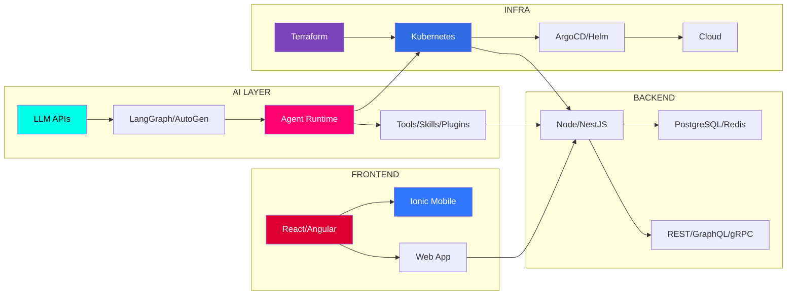
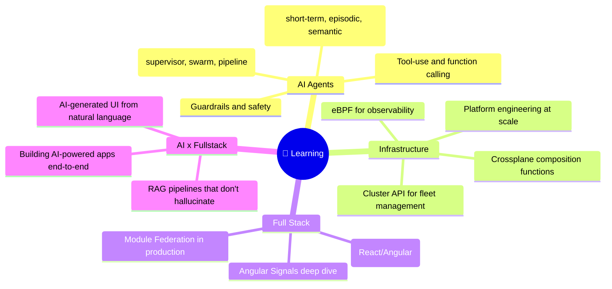

<p align="center">
  
</p>

<p align="center">
  
</p>

<p align="center">
  <a href="https://github.com/deb888/deb888"></a>
  <a href="https://github.com/deb888?tab=repositories"></a>
  <a href="https://github.com/openclaw/openclaw"></a>
</p>

<p align="center">
  
</p>

---

## 🧬 **ABOUT ME** — `THE SHORT VERSION`

```yaml
identity: "AI Developer who also does fullstack"
name: "Bruce Deb"
aka: "deb888"
fuel: "☕ Coffee + 🦞 Open Source + 🤖 LLM APIs"
vibe: "I take React/Angular code → wrap it in AI → deploy on K8s → repeat"

current_obsessions:
  - Building AI agents that actually do useful stuff
  - Making LLMs talk to databases without lying
  - Running models on my own hardware (privacy > convenience)
  - OpenClaw ecosystem (personal AI assistants for everyone)

the_pitch:
  frontend: "I can build your UI in Angular/React/Ionic"
  backend: "I can wire up your APIs in Node/NestJS/Python"  
  ai: "I can slap an LLM on top of it and make it smart"
  infra: "I can ship it all on Kubernetes with Terraform"
  mobile: "I can make it work on phones too (hybrid native)"

fun_fact: "I started with MEAN stack. Now I build AI agents that deploy themselves. The tools change. The builder stays."
```

---

## 🎯 **WHAT I ACTUALLY BUILD** — `PROJECTS THAT DO THINGS`

### 🦞 **OpenClaw — Personal AI Assistant** `[Core Contributor]`
> *An open-source AI agent that lives in your phone and actually does stuff — sends emails, checks calendars, controls smart homes, writes code*

```yaml
what: "Self-hosted AI gateway (Discord, Telegram, WhatsApp, iMessage, Slack → LLM)"
stack: "TypeScript · Node.js · MCP · Plugin Architecture"
my_part: "Skills engine, automation layer (cron/heartbeat/tasks), plugin SDK"
stars: "⭐ 380k+ on GitHub"
why_cool: "It's YOUR AI. Runs on your machine. Talks to your apps. Zero data leakage."
```

---

### 🧠 **AI Code Review Bot** `[Personal Project]`
> *Drop a PR link → it clones, tests, lints, security-scans, and posts a full review*

```yaml
trigger: "review PR #123"
stack: "LangGraph · CrewAI · gh CLI · Docker · Python/TS"
what_it_does:
  - Fetches PR diff and metadata
  - Checks out branch and runs tests
  - Lints every file (ESLint, Ruff, Clippy, golangci-lint)
  - Scans for security issues (secrets, injections, XSS)
  - Posts structured review to the PR
why_cool: "Saves hours. Catches things humans miss. Never complains about formatting."
```

---

### ☁️ **Platform Engineering Toolkit** `[Enterprise]`
> *Internal developer platform that lets 200+ engineers deploy in 15 minutes instead of 2 weeks*

```yaml
stack: "Backstage · Crossplane · ArgoCD · Kubernetes · Terraform"
achievements:
  - "50+ clusters across 3 clouds"
  - "Self-service golden paths (50+ templates)"
  - "Policy-as-code with Kyverno (500+ rules)"
  - "40% cloud cost reduction via FinOps automation"
  - "99.99% uptime for critical services"
```

---

### 📱 **Ionic/Angular Mobile Apps** `[Fullstack Classic]`
> *Hybrid mobile apps with real-time chat, tracking, and REST APIs*

```yaml
stack: "Angular · Ionic · Socket.io · Node.js · PostgreSQL · TypeScript"
repos:
  - "node-muter-imageupload-rest-api"
  - "ionic-chat-app"
  - "trackinionic"
  - "node-chat-socket.io-ionic"
why_it_matters: "This is where I learned to ship. Front to back. Web to mobile. Every layer."
```

---

## ⚡ **HOW I DO IT** — `STACK FLOW`



---

## 🛠️ **THE FULL TOOLBOX** — `DEV → AI → OPS`

### 🧠 **AI & ML**
| Tech | What I Do With It |
|------|-------------------|
| **LangChain / LangGraph** | Build multi-agent flows with planning, memory, tool use |
| **OpenClaw** | Core contributor — skills, automation, plugin system |
| **CrewAI / AutoGen** | Agent orchestration and delegation patterns |
| **vLLM / Ollama** | Self-host model serving (privacy-first) |
| **Qdrant / pgvector / Weaviate** | RAG pipelines — make LLMs actually remember stuff |
| **Axolotl / Unsloth** | Fine-tune models on custom data (LoRA/QLoRA) |
| **LangSmith / MLflow** | Trace, evaluate, and monitor LLM calls |

### 🌐 **Full Stack**
| Layer | Stack |
|-------|-------|
| **Frontend** | Angular 18+ (Signals, Standalone), React, Ionic, Tailwind |
| **State** | NgRx SignalStore, RxJS, React Query |
| **Backend** | NestJS, Fastify, Express, Python (FastAPI) |
| **Database** | PostgreSQL, MongoDB, Redis, TimescaleDB |
| **API** | REST, GraphQL Federation, gRPC, tRPC |
| **Mobile** | Ionic/Capacitor (iOS + Android from one codebase) |
| **Real-time** | Socket.io, WebSockets, WebRTC |
| **Testing** | Vitest, Playwright, Cypress, Testing Library |

### ☁️ **Cloud & Infrastructure**
| Tech | What I Do |
|------|-----------|
| **Kubernetes** | EKS/GKE/AKS — operators, CRDs, controllers |
| **Terraform / Pulumi** | IaC for everything — infra as code, not clickops |
| **ArgoCD / Flux** | GitOps — deploy from git, reconcile automatically |
| **Istio / Linkerd** | Service mesh — mTLS, traffic management, resilience |
| **Prometheus / Grafana** | Observability — metrics, logs, traces, alerts |
| **Helm / Kustomize** | Package and configure K8s apps |
| **Crossplane** | Control plane — infrastructure from Kubernetes APIs |
| **Backstage** | Developer portal — golden paths, self-service |

### 🔧 **Dev Tools & Workflow**
- **Languages:** TypeScript, JavaScript, Python, Go, Bash
- **IDEs:** VS Code, Cursor, WebStorm
- **CI/CD:** GitHub Actions, GitLab CI, Argo Workflows
- **Monorepo:** Nx, Turborepo, pnpm workspaces
- **Containers:** Docker, Podman, Kaniko, BuildKit

---

## 📈 **CODING METRICS** — `BECAUSE NUMBERS ARE COOL`

<p align="center">
  
  
</p>

<p align="center">
  
</p>

---

## 🏆 **ACHIEVEMENTS**

<p align="center">
  
</p>

---

## 🎯 **WHAT I'M LEARNING RIGHT NOW**



---

## 📡 **WHERE TO FIND ME**

<p align="center">
  <a href="https://github.com/deb888">
    
  </a>
  <a href="https://linkedin.com/in/brucedeb">
    
  </a>
  <a href="mailto:bruce@deb888.dev">
    
  </a>
  <a href="https://discord.gg/clawd">
    
  </a>
</p>

<p align="center">
  
</p>

<p align="center">
  <sub>
    Built with ⚡ by <a href="https://github.com/deb888">deb888</a> · 
    <a href="https://github.com/deb888/deb888">View Source</a> · 
    <b>AI Developer. Fullstack Architect. Cloud Native.</b><br>
    <i>"I build the frontend. I build the backend. I build the AI. I deploy it all on K8s."</i>
  </sub>
</p>

---

<!-- 
  ██████╗ ███████╗██████╗  █████╗ ██████╗ ██╗
  ██╔══██╗██╔════╝██╔══██╗██╔══██╗╚════██╗██║
  ██║  ██║█████╗  ██████╔╝███████║ █████╔╝██║
  ██║  ██║██╔══╝  ██╔══██╗██╔══██║ ╚═══██╗╚═╝
  ██████╔╝███████╗██████╔╝██║  ██║██████╔╝██║
  ╚═════╝ ╚══════╝╚═════╝ ╚═╝  ╚═╝╚═════╝ ╚═╝
  
  github.com/deb888/deb888
  "AI Developer. Fullstack. Cloud Native."
-->