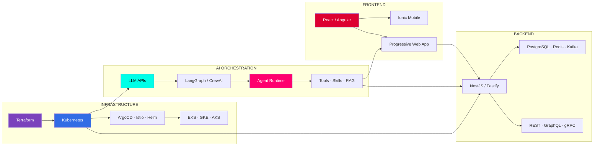
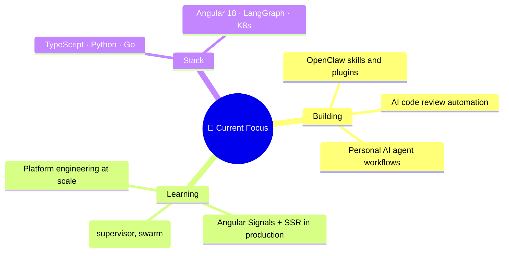

<p align="center">
  
</p>

<p align="center">
  
</p>

<p align="center">
  
  
  
  
</p>

<p align="center">
  
</p>

---

## 🧬 SYSTEM IDENTITY

```yaml
name: "Bruce Deb"
handle: "deb888"
role: "AI Developer · Fullstack Architect · Cloud Native Engineer"
mission: "Building AI-powered applications from frontend to infrastructure"
philosophy: "Fullstack is the foundation. AI is the multiplier."

domains:
  frontend:  "Angular 18+ (Signals, Standalone) · React · Ionic · Tailwind"
  backend:   "NestJS · Fastify · Python · PostgreSQL · Redis · Kafka"
  ai_ml:     "LangGraph · OpenClaw · CrewAI · vLLM · RAG · Fine-tuning"
  infra:     "Kubernetes · Terraform · ArgoCD · Istio · Crossplane"
  mobile:    "Ionic/Capacitor — one codebase, iOS + Android"
```

---

## ⚡ FROM FULLSTACK TO NEURAL STACK



---

## 🚀 PROJECTS THAT ACTUALLY DO THINGS

### 🦞 OpenClaw — Personal AI Assistant
> `380k+ ⭐ GitHub` · Core Contributor

*Self-hosted AI gateway. Chat with your agent via Telegram, WhatsApp, Discord, iMessage. It manages your email, calendar, code, smart home — on your hardware, zero data leakage.*

```
Stack:  TypeScript · Node.js · Plugin Architecture · MCP/ACP
My contribution:  Skills engine, automation layer (cron/heartbeat/tasks), plugin SDK
```

### 🧠 AI Code Review Bot
> Personal project

*Drop a PR link → my bot clones the repo, runs tests, lints, security-scans, and posts a full structured review with blocking/warning/suggestion categories.*

```
Stack:  LangGraph · CrewAI · gh CLI · Docker · Python/TypeScript
Trigger: "review PR #123" in any channel
```

### ☁️ Platform Engineering Framework
> Enterprise · 50+ clusters · 500+ services

*Internal developer platform. Self-service golden paths. Policy-as-code. 2-week provisioning → 15 minutes. 40% cloud cost reduction.*

```
Stack:  Backstage  Crossplane  ArgoCD  Kubernetes  Terraform
```

### 📱 Hybrid Mobile Apps
> Public repos with real users

*Real-time chat, GPS tracking, image upload — Angular + Ionic + Socket.io + Node.js from a single codebase.*

```
Repos: ionic-chat-app · trackinionic · node-muter-imageupload-rest-api
```

---

## 🧰 TOOLBOX

<details>
<summary><b>🧠 AI & Machine Learning</b> (click to expand)</summary>
<br>

| Tech | What I Build With It |
|------|---------------------|
| **LangChain / LangGraph** | Multi-agent flows with planning, memory, tool-use, and human-in-the-loop |
| **OpenClaw** | Personal AI assistants — skills engine, automation, plugin SDK (core contributor) |
| **CrewAI / AutoGen** | Agent teams — supervisor, swarm, pipeline orchestration patterns |
| **vLLM / Ollama** | Self-hosted model serving — privacy-first, runs on my hardware |
| **Qdrant / pgvector** | RAG pipelines — vector + hybrid search for grounded LLM responses |
| **Axolotl / Unsloth** | Fine-tuning — LoRA/QLoRA on custom data, domain adaptation |
| **LangSmith / MLflow** | LLM observability — traces, evaluations, prompt management |
</details>

<details>
<summary><b>⚛️ Full Stack</b> (click to expand)</summary>
<br>

| Layer | Stack |
|-------|-------|
| **Frontend** | Angular 18+ (Signals, Standalone, Zoneless), React, Ionic, Tailwind |
| **State** | NgRx SignalStore, RxJS, React Query, Zustand |
| **Backend** | NestJS, Fastify, Express, Python (FastAPI), Go |
| **Database** | PostgreSQL, MongoDB, Redis, TimescaleDB, ClickHouse |
| **API** | REST, GraphQL Federation, gRPC, tRPC, WebSocket |
| **Mobile** | Ionic/Capacitor — iOS + Android from one TypeScript codebase |
| **Testing** | Vitest, Playwright, Cypress, Testing Library |
</details>

<details>
<summary><b>☸️ Cloud & Infrastructure</b> (click to expand)</summary>
<br>

| Tech | What I Do With It |
|------|-------------------|
| **Kubernetes** | Operators, CRDs, custom controllers — EKS/GKE/AKS |
| **Terraform / Pulumi** | Infrastructure as Code — modules, workspaces, policy |
| **ArgoCD / Flux** | GitOps — deploy from git, auto-reconcile, drift detection |
| **Istio / Linkerd** | Service mesh — mTLS, traffic splitting, circuit breaking |
| **Prometheus / Grafana** | Observability — metrics, logs, traces, SLOs, alerts |
| **Backstage** | Developer portal — golden paths, software catalog |
| **Crossplane** | Control plane — infrastructure from Kubernetes API |
</details>

---

## 📊 ACTIVITY

<p align="center">
  
  
</p>

<p align="center">
  
</p>

<p align="center">
  
</p>

---

## 🎯 NOW



---

## 📡 CONNECT

<p align="center">
  <a href="https://github.com/deb888">
    
  </a>
  <a href="https://linkedin.com/in/brucedeb">
    
  </a>
  <a href="mailto:bruce@deb888.dev">
    
  </a>
  <a href="https://discord.gg/clawd">
    
  </a>
</p>

<p align="center">
  
</p>

<p align="center">
  <sub>
    <b>AI Developer · Fullstack Architect · Cloud Native</b><br>
    <i>"Frontend → Backend → AI → Infrastructure — I build it all."</i>
  </sub>
</p>

---

<!--
  deb888/deb888 — AI Developer Profile
  "Fullstack is the foundation. AI is the multiplier."
-->