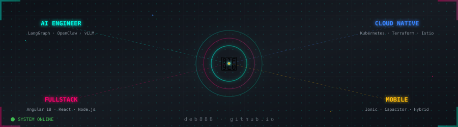
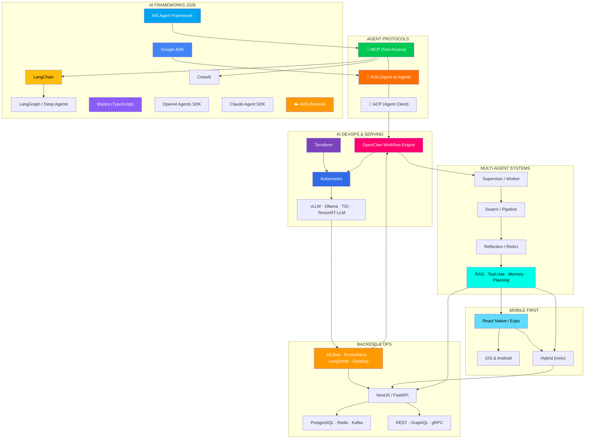
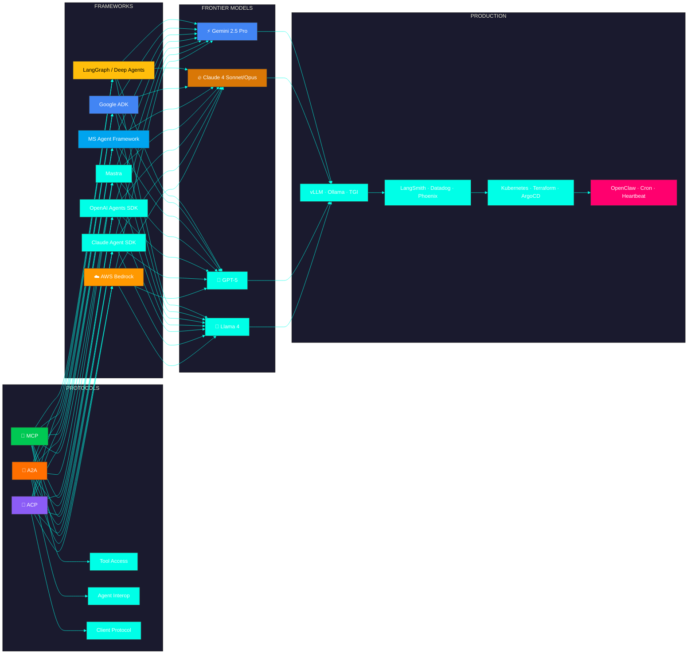
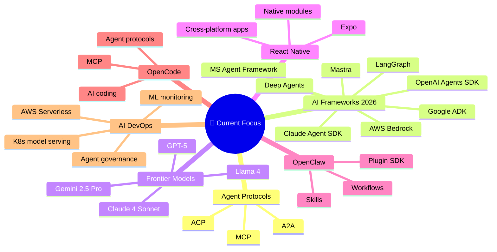

<p align="center">
  
</p>

<p align="center">
  
</p>

<p align="center">
  
  
  
  
  
  
  
  
  
  
  
  
  
  
  
  
</p>

<p align="center">
  
</p>

---

## 🧬 SYSTEM IDENTITY

```yaml
name: "Bruce Deb"
handle: "deb888"
role: "AI Developer · Fullstack Architect · AI DevOps Engineer"
mission: "Building AI-powered applications end-to-end — from React Native to LangChain agents deployed on Kubernetes"
philosophy: "Fullstack is the foundation. LangChain is the brain. Kubernetes is the body. OpenClaw is the heartbeat."

domains:
  mobile:       "React Native · Expo · Ionic/Capacitor — cross-platform native apps"
  ai_agents:    "LangChain · LangGraph · Deep Agents · Multi-Agent Systems · RAG · Tool-Use · Memory"
  agent_proto:  "MCP (Model Context Protocol) · A2A (Agent-to-Agent) · ACP (Agent Client Protocol)"
  frameworks:   "LangChain · CrewAI · Google ADK · Microsoft Agent Framework · Mastra · OpenAI Agents SDK"
  backend:      "NestJS · Fastify · Python · PostgreSQL · Redis · Kafka"
  frontend:     "Angular 18+ (Signals, Standalone) · React · Tailwind"
  aws:          "Bedrock · Lambda · API Gateway · DynamoDB · SQS · S3 — serverless AI on AWS"
  infra:        "Kubernetes · Terraform · ArgoCD · Istio · Crossplane"

tools_i_love:
  - "LangChain — The standard for LLM application development"
  - "LangGraph — Agent orchestration with cycles, state, and persistence"
  - "MCP — Model Context Protocol, the universal tool connector for AI"
  - "A2A — Google-led Agent-to-Agent protocol for multi-agent interoperability"
  - "Google ADK — Opinionated, batteries-included agent runtime for GCP"
  - "Microsoft Agent Framework — Unified AutoGen + Semantic Kernel at GA"
  - "Mastra — TypeScript-native agent framework with workflows + memory"
  - "Deep Agents — LangChain's long-running, persistent agent workflows"
  - "OpenAI Agents SDK — Clean multi-agent delegation with minimal abstraction"
  - "Claude Agent SDK — Anthropic's agent framework for tool-use and reasoning"
  - "OpenCode — AI coding agent I'm using right now to build this profile"
  - "OpenClaw — Personal AI assistant ecosystem (core contributor)"
  - "Gemini 2.5 / Claude 4 — The frontier models driving agent reasoning"
  - "React Native — One codebase, every platform"
  - "AWS Bedrock — Foundation models + agents as a managed service"
  - "AWS Serverless — Lambda, API Gateway, DynamoDB — pay-per-use AI backends"

ai_devops:
  ml_pipelines: "Kubeflow · MLflow · DVC · Weights & Biases"
  serving:      "AWS Bedrock · vLLM · TGI · Ollama · Triton Inference Server · TensorRT-LLM"
  monitoring:   "LangSmith · Prometheus · Grafana · Phoenix · Datadog"
  governance:   "Agent lifecycle management · Guardrails · Audit trails · Cost tracking"
  automation:   "OpenClaw Workflows · Cron · Heartbeat · Task Flow · Hooks"
```

---

## ⚡ THE AI ENGINEER STACK



---

## 🚀 PROJECTS THAT ACTUALLY DO THINGS

### 🦞 OpenClaw — Personal AI Assistant `[Core Contributor]`
> `382k+ ⭐ GitHub` *Self-hosted AI gateway connecting Telegram, WhatsApp, Discord, iMessage → AI agents*

```
Stack:     TypeScript · Node.js · Plugin Architecture · MCP/ACP
My part:   Skills engine, automation layer, plugin SDK, multi-agent routing
Workflows: Cron jobs · Heartbeat monitoring · Task Flow orchestration · Hooks · Standing Orders
```

### 🦜️ LangChain AI Agent Suite `[Building]`
> *Multi-agent system with planning, tool-use, persistent memory, and human-in-the-loop*

```
Stack:     LangChain · LangGraph · LangSmith · Qdrant · PostgreSQL
Patterns:  Supervisor/worker · Swarm · Pipeline · Reflection · ReAct
```

### 🔧 OpenCode + OpenClaw Integration `[Workflow]`
> *Using OpenCode (AI coding agent) paired with OpenClaw for autonomous development pipelines*

```
Setup:  OpenCode writes code → OpenClaw deploys it → Cron monitors it → Heartbeat reports back
Flow:   "write a Slack bot" → OpenCode codes it → OpenClaw deploys to K8s → Cron keeps it alive
```

### 📱 React Native Mobile Apps
> *Cross-platform native apps — one TypeScript codebase, iOS + Android*

```
Stack:    React Native · Expo · TypeScript · Socket.io
Projects: Real-time chat · GPS tracking · Image upload · REST APIs
```

### ☁️ AI DevOps Pipeline `[Enterprise]`
> *ML infrastructure: model serving, monitoring, auto-scaling, and cost optimization*

```
Stack:     Kubernetes · Terraform · vLLM · MLflow · Prometheus · Grafana
Scale:     50+ clusters · 500+ services · 99.99% uptime
```

---

## 🔥 TRENDING NOW — 2026 AI Agent Stack



**2026 Key Trends:**
- 🔌 **MCP** — Universal standard for AI-to-tool connectivity (Anthropic-led)
- 🤝 **A2A** — Google-led Agent-to-Agent protocol for cross-framework interop
- 🪟 **Microsoft Agent Framework** — AutoGen + Semantic Kernel unified at GA
- 🎯 **Google ADK** — Batteries-included agent runtime for GCP-native stacks
- 📦 **Mastra** — TypeScript-native agent framework (workflows, memory, Studio)
- 🌀 **Deep Agents** — LangChain's long-running persistent agent workflows
- 🔥 **Claude 4 / Gemini 2.5 / GPT-5** — Frontier models driving agent reasoning
- 🛡️ **Agent Governance** — Lifecycle management, guardrails, cost tracking

---

## 📊 COMPETENCY MATRIX

<p align="center">
  
</p>

---

## 🧰 TOOLBOX

<details>
<summary><b>🦜️ LangChain & AI Agents</b> (click to expand)</summary>
<br>

| Tech | What I Build With It |
|------|---------------------|
| **LangChain** | LLM app framework — chains, agents, RAG, tool-use, memory |
| **LangGraph** | Stateful agent orchestration — cycles, branching, persistence |
| **Deep Agents** | Long-running persistent agent workflows with LangChain |
| **LangSmith** | LLM observability — traces, evaluations, prompt management |
| **Google ADK** | Batteries-included agent runtime for GCP with A2A interop |
| **MS Agent Framework** | Unified AutoGen + Semantic Kernel (GA) for .NET/enterprise |
| **Mastra** | TypeScript-native agents with workflows, memory, and Studio |
| **OpenAI Agents SDK** | Clean multi-agent delegation with minimal abstraction |
| **Claude Agent SDK** | Anthropic's agent SDK — tool-use, reasoning, handoffs |
| **CrewAI** | Role-based multi-agent teams — rapid prototyping |
| **MCP Servers** | Model Context Protocol — universal tool connectivity |
| **A2A Protocol** | Agent-to-Agent interoperability across frameworks |
| **OpenClaw** | Personal AI assistants — skills engine, automation, plugin SDK |
| **Qdrant / pgvector** | Vector stores for RAG — hybrid search, filtering, re-ranking |
| **vLLM / Ollama / TGI** | Self-hosted model serving — privacy-first, local inference |
| **AWS Bedrock** | Managed FM access — Claude, Llama, Mistral + agents via AWS |
</details>

<details>
<summary><b>⚛️ React Native & Mobile</b> (click to expand)</summary>
<br>

| Layer | Stack |
|-------|-------|
| **Framework** | React Native, Expo, Ionic/Capacitor |
| **Navigation** | React Navigation, Expo Router |
| **State** | React Query, Zustand, Redux Toolkit |
| **UI** | NativeBase, Tamagui, Tailwind Native |
| **Native APIs** | Camera, Geolocation, Bluetooth, Push Notifications |
| **Build** | EAS Build, Xcode, Android Studio, Fastlane |
| **Store** | App Store Connect, Google Play Console |
</details>

<details>
<summary><b>🔧 OpenCode & AI Development</b> (click to expand)</summary>
<br>

| Tech | What I Do With It |
|------|-------------------|
| **OpenCode** | AI coding agent — building this profile and more |
| **Claude Code / Codex** | Terminal-based AI coding assistants |
| **OpenClaw + OpenCode** | Autonomous dev loop — OpenCode writes, OpenClaw deploys |
| **MCP Servers** | Model Context Protocol — connecting AI to tools and data |
| **A2A Protocol** | Agent-to-Agent — multi-framework agent coordination |
| **ACP Agents** | Agent Client Protocol — multi-agent coordination |
| **Genkit** | Google's open-source AI framework for TypeScript/Node.js |
</details>

<details>
<summary><b>☸️ AI DevOps & MLOps</b> (click to expand)</summary>
<br>

| Tech | What I Do With It |
|------|-------------------|
| **Kubernetes** | Model serving infrastructure — EKS/GKE/AKS |
| **AWS Serverless** | Lambda · API Gateway · DynamoDB · SQS · S3 — serverless AI backends |
| **vLLM / TGI / TensorRT-LLM** | LLM inference serving with continuous batching |
| **Terraform / Pulumi / Crossplane** | Infrastructure as Code for ML platforms |
| **MLflow / W&B** | Experiment tracking, model registry, artifact storage |
| **Prometheus / Grafana / Datadog** | Model monitoring — latency, throughput, token usage |
| **LangSmith / Phoenix** | LLM observability — traces, evals, prompt management |
| **ArgoCD / Flux** | GitOps for model deployments |
| **Kubeflow / Flyte** | ML pipelines on Kubernetes |
| **Agent Governance** | Lifecycle mgmt, guardrails, audit trails, cost tracking |
</details>

<details>
<summary><b>🦞 OpenClaw Workflow Engine</b> (click to expand)</summary>
<br>

| Feature | What It Does |
|---------|--------------|
| **Cron Jobs** | Scheduled tasks — daily reports, reminders, batch jobs |
| **Heartbeat** | Periodic agent turns every ~30 min — inbox check, calendar scan |
| **Task Flow** | Durable multi-step orchestration with revision tracking |
| **Hooks** | Event-driven scripts — session lifecycle, message flow |
| **Standing Orders** | Persistent agent instructions (AGENTS.md) |
| **Inferred Commitments** | Memory-like follow-ups from natural conversation |
| **Skills** | SKILL.md instruction packs — teach agents new abilities |
| **Plugins** | Channel, tool, and provider extensions from ClawHub |
</details>

<details>
<summary><b>⚛️ Full Stack</b> (click to expand)</summary>
<br>

| Layer | Stack |
|-------|-------|
| **Frontend** | Angular 18+ (Signals, Standalone), React, Tailwind |
| **Backend** | NestJS, Fastify, Express, Python (FastAPI), Go |
| **Database** | PostgreSQL, MongoDB, Redis, TimescaleDB, ClickHouse |
| **API** | REST, GraphQL Federation, gRPC, tRPC, WebSocket |
| **Mobile** | React Native, Expo, Ionic/Capacitor |
| **Testing** | Vitest, Playwright, Cypress, Testing Library |
</details>

---

## 📊 ACTIVITY

<p align="center">
  
  
</p>

<p align="center">
  
</p>

<p align="center">
  
</p>

---

## 🎯 NOW



---

## 📡 CONNECT

<p align="center">
  <a href="https://github.com/deb888">
    
  </a>
  <a href="https://linkedin.com/in/brucedeb">
    
  </a>
  <a href="mailto:wwwdeb888@gmail.com">
    
  </a>
  <a href="https://discord.gg/clawd">
    
  </a>
  <a href="https://github.com/openclaw/openclaw">
    
  </a>
</p>

<p align="center">
  
</p>

<p align="center">
  <sub>
    <b>AI Developer · Fullstack · AI DevOps · OpenCode · OpenClaw</b><br>
    <i>"React Native → LangChain → Kubernetes → OpenClaw workflow — I build the whole pipeline."</i>
  </sub>
</p>

---

<!--
  deb888/deb888 — AI Developer Profile
  Built with OpenCode 🤖
  "Fullstack is the foundation. LangChain is the brain. K8s is the body. OpenClaw is the heartbeat."
-->