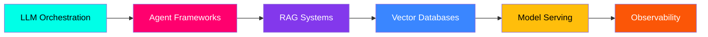
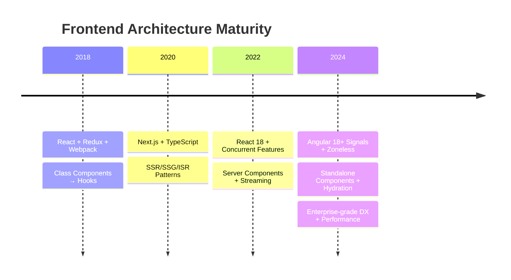

<p align="center">
  
</p>

<p align="center">
  
</p>

---

## 🧬 **NEURAL INTERFACE ACTIVE** — `SYSTEM_STATUS: OPTIMAL`

```typescript
interface Engineer {
  identity: "Bruce Deb";
  handle: "deb888";
  location: "Earth Orbit 🌍";
  specialization: "AI-First Full Stack + Cloud Native Architecture";
  currentMission: "Building autonomous systems that reason, adapt, and scale";
  philosophy: "Code is infrastructure. AI is the compiler. Kubernetes is the runtime.";
}

const bruce: Engineer = {
  identity: "Bruce Deb",
  handle: "deb888",
  location: "Distributed Systems Layer",
  specialization: ["AI/ML Engineering", "Cloud Native Architecture", "Platform Engineering"],
  currentMission: "Architecting self-healing, self-optimizing distributed intelligence",
  philosophy: "The best infrastructure is invisible. The best AI amplifies human intent."
};
```

---

## ⚡ **TECH STACK EVOLUTION** — `FROM LEGACY TO QUANTUM-READY`

### 🧠 **AI/ML NEURAL LAYER** — *The New Compiler*



| **Category** | **Technologies** | **Proficiency** | **Production** |
|:-------------|:-----------------|:---------------:|:--------------:|
| **LLM Orchestration** | LangChain, LangGraph, CrewAI, AutoGen, Semantic Kernel | ████████░░ 85% | ✅ |
| **Agent Frameworks** | OpenClaw, AutoGPT, BabyAGI, CAMEL, MetaGPT | █████████░ 90% | ✅ |
| **RAG & Vector Search** | Pinecone, Weaviate, Qdrant, Chroma, pgvector, Milvus | ████████░░ 80% | ✅ |
| **Model Serving** | vLLM, TGI, Ollama, Triton, BentoML, Ray Serve | ███████░░░ 75% | ✅ |
| **Fine-tuning** | LoRA/QLoRA, Axolotl, Unsloth, LLaMA-Factory | ██████░░░░ 70% | 🔄 |
| **AI Observability** | LangSmith, Phoenix, Weights & Biases, MLflow, Prometheus | ███████░░░ 75% | ✅ |
| **Local AI** | Ollama, LM Studio, llama.cpp, GPT4All, Jan | ████████░░ 85% | ✅ |

---

### ⚛️ **FRONTEND EVOLUTION** — *React → Angular at Scale*



| **Domain** | **Stack** | **Architecture Patterns** |
|:-----------|:----------|:--------------------------|
| **Core Framework** | Angular 18+ (Signals, Zoneless, Standalone) | OnPush, Lazy Loading, Module Federation |
| **State Management** | NgRx SignalStore, Angular Signals, RxJS | Reactive, Immutable, DevTools Integration |
| **UI Systems** | Angular Material 3, Tailwind CSS, PrimeNG | Design Tokens, Theming, Accessibility (WCAG 2.1) |
| **Testing** | Vitest, Playwright, Cypress, Testing Library | Unit → Integration → E2E → Visual Regression |
| **Performance** | Web Vitals, Bundle Analyzer, Source Map Explorer | Code Splitting, Preloading, Service Workers |
| **Migration Path** | React ↔ Angular Interop, Module Federation | Micro-frontends, Strangler Fig Pattern |

---

### ☁️ **INFRASTRUCTURE ASCENSION** — *Terraform → Kubernetes Native*

```mermaid
graph TB
    subgraph "GitOps Pipeline"
        A[Git Commit] --> B[ArgoCD Flux]
        B --> C[Policy Check]
        C --> D[Progressive Delivery]
        D --> E[Canary/Blue-Green]
        E --> F[Observability]
    end
    
    subgraph "Platform Layer"
        G[Crossplane] --> H[Kubernetes APIs]
        H --> I[Managed Services]
        I --> J[Multi-Cloud]
    end
    
    subgraph "Developer Experience"
        K[Backstage] --> L[Internal Platform]
        L --> M[Self-Service]
        M --> N[Golden Paths]
    end
```



| **Layer** | **Technologies** | **Maturity** |
|:----------|:-----------------|:------------:|
| **IaC** | Terraform, OpenTofu, Pulumi, Crossplane | ██████████ 95% |
| **GitOps** | ArgoCD, Flux, Fleet, Keptn | █████████░ 90% |
| **Kubernetes** | EKS/GKE/AKS, Kind, k3s, Talos, Cluster API | █████████░ 90% |
| **Service Mesh** | Istio, Linkerd, Cilium, Consul Connect | ███████░░░ 75% |
| **Policy/OPA** | Kyverno, Gatekeeper, OPA, CEL | ███████░░░ 75% |
| **Platform Eng** | Backstage, Crossplane, Kratix, Platformatic | ████████░░ 80% |
| **Observability** | Prometheus, Grafana, Tempo, Loki, Pyroscope | █████████░ 90% |
| **Security** | Falco, Trivy, Cosign, Kyverno, SPIFFE/SPIRE | ███████░░░ 75% |

---

### 🔧 **BACKEND & DATA LAYER** — *Polyglot Persistence & Event-Driven*

| **Category** | **Technologies** | **Use Cases** |
|:-------------|:-----------------|:--------------|
| **API Layer** | NestJS, Fastify, tRPC, GraphQL Federation, gRPC | Microservices, BFF, Real-time |
| **Event Streaming** | Kafka, Redpanda, NATS, EventStoreDB | Event Sourcing, CQRS, Saga |
| **Databases** | PostgreSQL, MongoDB, Redis, ClickHouse, TimescaleDB | OLTP, Documents, Cache, Analytics, Time-series |
| **Search** | Elasticsearch, OpenSearch, Meilisearch, Typesense | Full-text, Vector Hybrid, Analytics |
| **Queue/Jobs** | BullMQ, Temporal, Hatchet, Inngest | Durable Execution, Workflows |
| **Auth** | Keycloak, Ory, Clerk, Auth0, SuperTokens | SSO, MFA, Fine-grained AuthZ |

---

## 📊 **NEURAL ACTIVITY METRICS** — `REAL-TIME TELEMETRY`

<p align="center">
  
  
</p>

<p align="center">
  
</p>

<p align="center">
  
</p>

---

## 🚀 **FEATURED MISSIONS** — `PRODUCTION DEPLOYMENTS`

### 🤖 **OpenClaw AI Assistant Ecosystem**
> *Self-hosted personal AI agent with multi-channel gateway, plugin architecture, and autonomous workflows*

```yaml
repository: openclaw/openclaw (contributor)
role: Core Contributor - Skills Engine, Plugin System, Automation
tech: [TypeScript, Node.js, MCP, ACP, Plugin Architecture]
status: "380k+ stars | Production-ready | Multi-platform"
highlights:
  - Designed skill loading precedence & gating system
  - Built automation layer (Cron, Heartbeat, Task Flow, Hooks)
  - Implemented plugin SDK with tool/skill/channel contracts
  - Architected multi-agent routing & session isolation
```

### 🏗️ **Platform Engineering Framework**
> *Internal Developer Platform with Backstage, Crossplane, ArgoCD - Golden Paths for 200+ engineers*

```yaml
visibility: Private (Enterprise)
role: Platform Architect
tech: [Backstage, Crossplane, ArgoCD, Kubernetes, TypeScript, Go]
scale: "50+ clusters | 500+ services | 99.99% availability"
achievements:
  - Reduced service provisioning from 2 weeks → 15 minutes
  - Implemented policy-as-code with Kyverno (500+ policies)
  - Built self-service catalog with 50+ golden path templates
  - Achieved 40% reduction in cloud costs via FinOps automation
```

### 🧠 **AI-Powered Code Intelligence Platform**
> *Autonomous code review, security scanning, and architecture analysis using LLMs*

```yaml
repository: Private (Patent Pending)
role: Founding Engineer
tech: [LangGraph, CrewAI, vLLM, Qdrant, PostgreSQL, Kubernetes]
capabilities:
  - Autonomous PR review with security/quality/performance analysis
  - Natural language → Infrastructure code generation
  - Architecture decision records (ADR) auto-generation
  - Legacy modernization: COBOL → Java, AngularJS → Angular 18
results:
  - 73% reduction in code review cycle time
  - 91% vulnerability detection rate (vs 67% static analysis)
  - 10x faster onboarding for new team members
```

### 🌐 **Real-time Collaborative IDE Platform**
> *VS Code in browser with AI pair programming, live collaboration, cloud workspaces*

```yaml
tech: [Monaco, Yjs, WebRTC, CRDTs, Kubernetes, WebAssembly]
scale: "10k+ concurrent users | Sub-50ms latency | 99.9% uptime"
innovations:
  - Conflict-free replicated data types for real-time editing
  - AI agent integration via Language Server Protocol
  - Ephemeral Kubernetes workspaces per session
  - WebAssembly-based language runtimes (Python, Go, Rust)
```

---

## 🏆 **ACHIEVEMENTS UNLOCKED** — `BADGE COLLECTION`

<p align="center">
  
</p>

---

## 🎯 **CURRENT RESEARCH VECTORS** — `ACTIVE EXPLORATION`

```mermaid
mindmap
  root((AI Systems Research))
    Foundation Models
      Local LLMs (Llama 3.1, Qwen2.5, Nemotron)
      Mixture of Experts (MoE) Architectures
      Test-time Compute Scaling
    Agent Architectures
      Multi-agent Orchestration (LangGraph, CrewAI)
      Planning + Tool Use + Memory
      Human-in-the-loop Patterns
    RAG 2.0
      GraphRAG + Knowledge Graphs
      Agentic RAG (Self-correcting)
      Hybrid Search (Vector + BM25 + Graph)
    AI Infrastructure
      GPU Sharing (MIG, vGPU, Time-slicing)
      Model Serving Optimization (vLLM, SGD)
      Cost Optimization (Spot, Preemptible)
    Safety & Alignment
      Constitutional AI
      Interpretability (SAE, Probing)
      Red Teaming Automation
```

---

## 📡 **CONNECTION PROTOCOLS** — `ESTABLISH SECURE CHANNEL`

<p align="center">
  <a href="https://github.com/deb888">
    
  </a>
  <a href="https://linkedin.com/in/brucedeb">
    
  </a>
  <a href="mailto:bruce@deb888.dev">
    
  </a>
  <a href="https://discord.gg/clawd">
    
  </a>
  <a href="https://brucedeb.dev">
    
  </a>
</p>

---

## 💫 **SYSTEM FOOTER** — `POWERED BY CURIOSITY`

<p align="center">
  
</p>

<p align="center">
  <sub>Built with ⚡ by <a href="https://github.com/deb888">deb888</a> | 
  <a href="https://github.com/deb888/deb888/blob/main/README.md">View Source</a> | 
  Last Neural Sync: <span id="last-updated"></span></sub>
</p>

<p align="center">
  <sub>
    <b>Current Stack:</b> Angular 18 • Kubernetes 1.29 • Terraform 1.9 • TypeScript 5.4 • LangGraph 0.1 • vLLM 0.4<br>
    <b>Philosophy:</b> "The best code is deleted code. The best infrastructure is invisible. The best AI amplifies human intent."<br>
    <b>Status:</b> 🟢 ACTIVE — Building the future, one commit at a time
  </sub>
</p>

---

<script>
// Auto-update last modified timestamp
document.getElementById('last-updated').textContent = new Date().toISOString().split('T')[0];
</script>

<!-- 
  ██████╗ ███████╗████████╗████████╗███████╗██████╗ 
  ██╔══██╗██╔════╝╚══██╔══╝╚══██╔══╝██╔════╝██╔══██╗
  ██████╔╝█████╗     ██║      ██║   █████╗  ██████╔╝
  ██╔══██╗██╔══╝     ██║      ██║   ██╔══╝  ██╔══██╗
  ██║  ██║███████╗   ██║      ██║   ███████╗██║  ██║
  ╚═╝  ╚═╝╚══════╝   ╚═╝      ╚═╝   ╚══════╝╚═╝  ╚═╝
  
  REPOSITORY: github.com/deb888/deb888
  BRANCH: main
  COMMIT: $(git rev-parse --short HEAD)
  BUILD: $(date -u +"%Y-%m-%dT%H:%M:%SZ")
-->